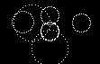
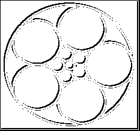
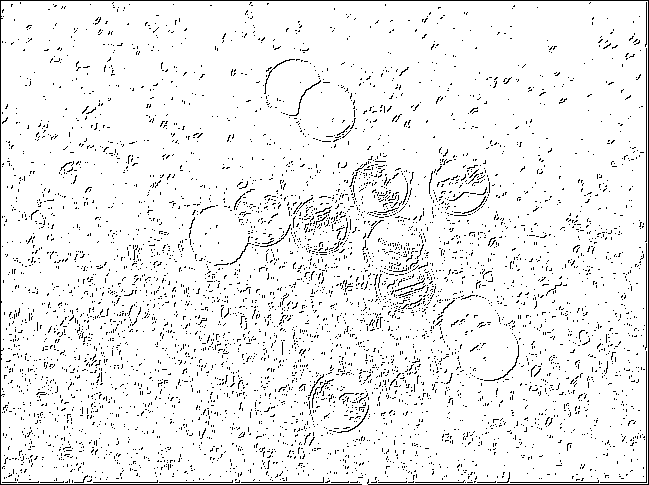
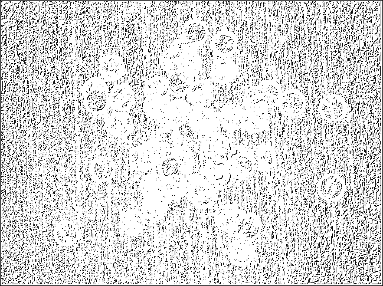
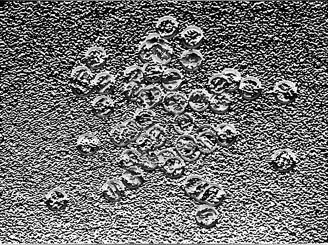
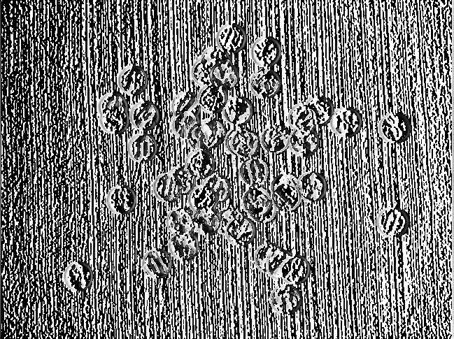
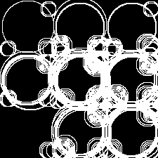
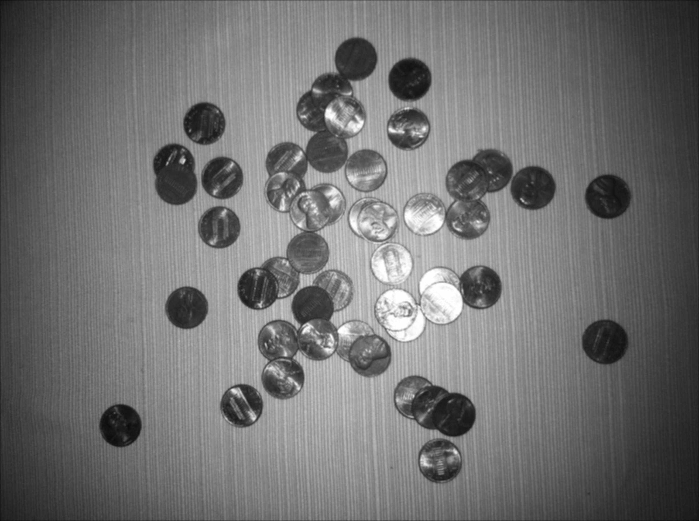

#Image Transformations -

<i>
This is a computer vision project written in C++ with libpng library to perform image transformations and Hough circle detection for given images. I originally wrote this project for Computer Vision course during my masters degree back in 2012. It is since been lying around on my server space for a while but never attempted to put it on GitHub, so here we go! </i>

This project is written in C++ for performance benefits. It takes approximately 9 seconds to execute all listed operations on Mac OS X 10.10 "Yosemite", Intel 2.3GHz i7 processor and 16 GB RAM. Also, if you want to run this project on your local machine. Make sure you have GCC installed on the system. (Project was tested on GCC v4.2.1)
It also has a dependency of libpng library which helps in converting png images to suitable format for applying transformation operations. libpng binaries could be installed from http://ethan.tira-thompson.com/Mac_OS_X_Ports.html for Mac OS X. For installing libpng on OSs other than Mac, please refer to official libpng website at http://www.libpng.org/pub/png/libpng.html

<b><i>
Fo operations are performed on an input image which are required for final operation to detect circles using Hough's transformation for image circle detection. </i></b>

1. Converting input image to gray scale version
2. Subsampling image to certain degree based on the input value of subsampling. Subsampling is the process of reducing image resolution by only taking pixels from from certain range. User can input a parameter for extent of subsampling.
3. Applying Gaussian filter. It removes noisy and smooth out the image. It is important to apply Gaussian filter before subsampling to avoid jagged version of subsampled image. (For more information https://courses.cs.washington.edu/courses/cse455/09wi/Lects/lect3.pdf)
4. Applying mean filter - It applies mean filter to image. User must specify the required size of mask to be applied to image.
5. Edge detection using Sobel filter - We apply sobel filter in both X and Y directions to get images based on it. We will get edges aligned to respective axes when this filter is applied
6. Hough circle detection algorithm - This is the final step on the operation. An image with all edges detected is fed to this method which will then use Hough's algorithm to detect circles in an input image. User must specify the radius of circle to be detected through command line parameters

<i>
Options : 
 
User can specify following options before applying above mentioned transformation to input image
<i>

1. Image <image to process>
2. Sigma <sigma value of the gaussian kernel>
3. Factor <factor for subsampling>
5. Thresh <threshold for edge detection>
6. Gauss_kernel_size <size of the gauss kernel>
7. Hough_radius <radius of the circle to be detected>
8. Hough_vote <vote threshold of the pixels in hough space>

<i>
These options should be given in a sequential form. If options are omitted, default values will be considered for respective operations.
</i>

Command line input format for these options is : 
./[Object_file_name] [image_name] [sigma] [factor_for_subsampling] [threshold] [gauss_kernel_size] [Hough_circle_detection_radius] [Hough_threshold_for_vote]

<b>Demo :  </b>
 
Some of demos from actual run of this project are as follows : 

1. Original Image
  

    
  

2. Detected Circles
  

    
  

3. Detected edges and Circles
  

    
  

4. Coins Edge detection
  

    
  

5. Coins Edge detection
  

    
  

6. Gauss filter applied to an image
  

    
  

7. Sobel filter applied in X direction
  

    
  

8. Sobel filter applied in Y direction
  

    
  

9. Original image to gray scale conversion
  

    
  

10. Circles detected using Hough transform
  

    
  

11. Mean filter applied to an image
  
o
    
  

<b><i>Limitations : This project only supports certain images with png extensions. Images with extensions other than this are not yet supported for this version. </i></b>
